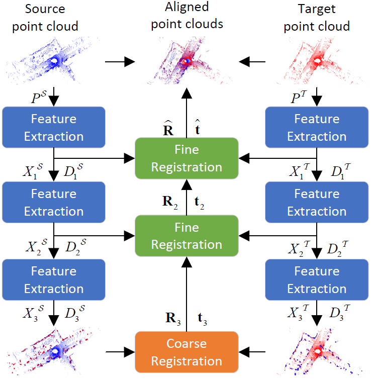

## HRegNet: A Hierarchical Network for Large-scale Outdoor LiDAR Point Cloud Registration

### Introduction
The repository contains the source code and pre-trained models of our paper (published on ICCV 2021): `HRegNet: A Hierarchical Network for Large-scale Outdoor LiDAR Point Cloud Registration`.

The overall network architecture is shown below:
<center>

</center>

### News
We have fixed some bugs in the code and updated the pretrained weights for both two datasets. The registration performance would be better than the reported performance in the paper. The current tested results are listed here:

#### KITTI dataset
|RTE (m)|RRE (deg)|Success rate|
|:----:|:----:|:----:|
|0.0557+-0.0746|0.1780+-0.1959|99.77%|

#### NuScenes dataset
|RTE (m)|RRE (deg)|Success rate|
|:----:|:----:|:----:|
|0.1218+-0.1122|0.2734+-0.1970|100.0%|

### Environments
The code mainly requires the following libraries and you can check `requirements.txt` for more environment requirements.
- PyTorch 1.7.0/1.7.1
- Cuda 11.0/11.1
- [pytorch3d 0.3.0](https://github.com/facebookresearch/pytorch3d)
- [MinkowskiEngine 0.5](https://github.com/NVIDIA/MinkowskiEngine)

Please run the following commands to install `point_utils`
```
cd models/PointUtils
python setup.py install
```

**Training device**: NVIDIA RTX 3090

### Datasets
The point cloud pairs list and the ground truth relative transformation are stored in `data/kitti_list` and `data/nuscenes_list`. 
The data of the two datasets should be organized as follows:
#### KITTI odometry dataset
```
DATA_ROOT
├── 00
│   ├── velodyne
│   ├── calib.txt
├── 01
├── ...
```
#### NuScenes dataset
```
DATA_ROOT
├── v1.0-trainval
│   ├── maps
│   ├── samples
│   │   ├──LIDAR_TOP
│   ├── sweeps
│   ├── v1.0-trainval
├── v1.0-test
│   ├── maps
│   ├── samples
│   │   ├──LIDAR_TOP
│   ├── sweeps
│   ├── v1.0-test
```
### Train
The training of the whole network is divided into two steps: we firstly train the feature extraction module and then train the network based on the pretrain features.
#### Train feature extraction
- Train keypoints detector by running `sh scripts/train_kitti_det.sh` or `sh scripts/train_nusc_det.sh`, please reminder to specify the `GPU`,`DATA_ROOT`,`CKPT_DIR`,`RUNNAME`,`WANDB_DIR` in the scripts.
- Train descriptor by running `sh scripts/train_kitti_desc.sh` or `sh scripts/train_nusc_desc.sh`, please reminder to specify the `GPU`,`DATA_ROOT`,`CKPT_DIR`,`RUNNAME`,`WANDB_DIR` and `PRETRAIN_DETECTOR` in the scripts.

#### Train the whole network
Train the network by running `sh scripts/train_kitti_reg.sh` or `sh scripts/train_nusc_reg.sh`, please reminder to specify the `GPU`,`DATA_ROOT`,`CKPT_DIR`,`RUNNAME`,`WANDB_DIR` and `PRETRAIN_FEATS` in the scripts.

**Update**: Pretrained weights for detector and descriptor are provided in `ckpt/pretrained`. If you want to train descriptor, you can set `PRETRAIN_DETECTOR` to `DATASET_keypoints.pth`. If you want to train the whole network, you can set `PRETRAIN_FEATS` to `DATASET_feats.pth`.

### Test
We provide pretrain models in `ckpt/pretrained`, please run `sh scripts/test_kitti.sh` or `sh scripts/test_nusc.sh`, please reminder to specify `GPU`,`DATA_ROOT`,`SAVE_DIR` in the scripts. The test results will be saved in `SAVE_DIR`.

### Citation
If you find this project useful for your work, please consider citing:
```
@InProceedings{Lu_2021_HRegNet,
        author = {Lu, Fan and Chen, Guang and Liu, Yinlong and Zhang Lijun, Qu Sanqing, Liu Shu, Gu Rongqi},
        title = {HRegNet: A Hierarchical Network for Large-scale Outdoor LiDAR Point Cloud Registration},
        booktitle = {Proceedings of the IEEE/CVF International Conference on Computer Vision},
        year = {2021}
}
```

### Acknowledgments
We want to thank all the ICCV reviewers and the following open-source projects for the help of the implementation:

- [DGR](https://github.com/chrischoy/DeepGlobalRegistration)(Point clouds preprocessing and evaluation)
- [PointNet++](https://github.com/sshaoshuai/Pointnet2.PyTorch)(unofficial implementation, for Furthest Points Sampling)